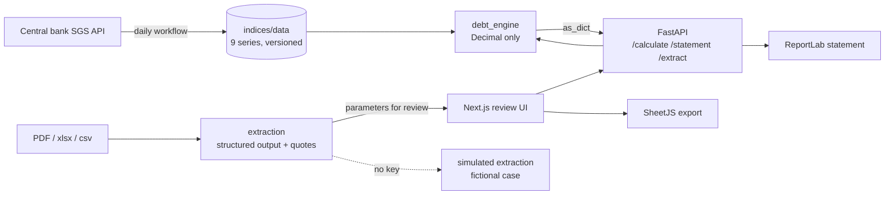

# court-debt-calculator

A calculator for updating court-ordered debts in Brazil: a deterministic engine over official monthly indices (monetary adjustment, default interest, deductions, attorney fees, enforcement surcharges), validated to the cent against public court calculators, with an API, a language-model extraction that pre-fills the parameters from the judgment for a lawyer to review, and a review UI that prints a neutral PDF statement for the case file. Built for a litigation team that drew up these statements by hand; rebranded and anonymised here.

 

**Status:** delivered and in use by the original team, extraction in beta · **Runs offline:** yes, the calculation needs no key and the extraction falls back to a simulated mode

```
$ uv run debt-engine calculate --file docs/sample-case.json
Date                Amount      Factor      Adjusted  Interest %     Interest         Total
02/03/2022   R$ 134.000,00    1.211124 R$ 162.290,65   0.044776%     R$ 72,67 R$ 162.363,32
-------------------------------------------------------------------------------------------
Gross total (A):          R$ 162.363,32
Art. 523 fine (B):        R$ 16.236,33
Art. 523 fees (C):        R$ 16.236,33
Creditor's amount:        R$ 178.599,65
GRAND TOTAL:              R$ 194.835,98

$ uv run debt-engine factor --index ipca --start 2026-01 --end 2027-06
[ERROR] IPCA: month 2026-07 not published/ingested. Latest available: 2026-06. The calculation cannot proceed: the engine never extrapolates indices.
```

Amounts are Brazilian reais in the Brazilian format (R$ 1.234,56) because the statement goes into a Brazilian court file. The parties and the case number of the demo are invented.

## The problem

When a Brazilian court orders a payment, the amount in the judgment is never the amount collected. It has to be adjusted for inflation by the index the decision names (which changed for the whole country in 2024), accrue default interest under a timeline with three legal regimes and a pro-rata switch in the middle of a month, lose a contractual penalty and assessed deductions, gain court fees adjusted from their own dates, gain the attorney fees awarded by the court, and then take a 10 % fine and 10 % fees when the debtor does not pay in fifteen days. Lawyers did this in spreadsheets, checked it against public court calculators that disagree with each other in the sixth decimal and occasionally with themselves, and the opposing party's accountant would challenge any cent that did not add up. The team wanted a statement whose every total is the exact sum of what is printed, produced from parameters read out of the decision, in minutes instead of an afternoon.

## What it does

- Adjusts every amount by full months with the composite index of two courts (INPC → IPCA, INPC → IPCA-15) or any single series, from nine central-bank series versioned in git and refreshed daily by a workflow that refuses retroactive changes.
- Computes default interest under the legal timeline (0.5 % → 1 % → the Legal Rate of Law 14,905/2024), the Legal Rate alone, or a fixed monthly rate, with the conventions of the public calculators decoded and tested.
- Builds the cascade a Brazilian enforcement petition needs: contractual penalty, fixed deductions, a late fine that adds, awarded fees (over the net amount or the claim value, or as the claim itself), fees written into the title, dated court fees and discounts, the art. 523 surcharges, the creditor's amount and an informative line for the creditor's own contract fees.
- Reads the judgment, the appellate decision, the payment history or a spreadsheet with a language model that returns each parameter with a literal quote and a confidence, applies the decision hierarchy (the most recent decision prevails on the point it changed; an approved settlement replaces the merits) and never invents a value: what the documents do not state comes back "not identified".
- Prints the statement as a neutral PDF, exports it to Excel, copies a text summary, keeps calculations in the browser and refuses any month the statistics office has not published yet.

## Architecture



The engine (`src/debt_engine`) is pure Python over `decimal.Decimal`: an index repository, the interest module, and the calculation that turns installments and parameters into lines and a cascade of totals, all exposed through one dictionary. The API (`src/debt_api`) is a thin shell: Pydantic schemas that carry money as decimal strings, the PDF renderer that reads the same dictionary as the screen and recomputes nothing, and the extraction module, the only place a model is called. The web app proxies the API server-side so the token never reaches the browser, and pre-fills its form from the extraction for a human to confirm. The ingestion script is the only writer of `indices/data`.

## Design decisions

- **The model never does the arithmetic.** The extraction returns parameters, quotes and confidences; a lawyer reviews them; the engine computes. A wrong amount from a language model looks exactly like a right one, and the opposing party will find it. Cost: three layers where one prompt could produce a number, and a review screen that has to earn its place.
- **Decimal end to end, and totals are sums of printed lines.** The public calculator of one court displays a creditor's amount that does not equal its own displayed lines plus fine (float64 aggregation, R$ 0.01 off). The engine rounds each line, adds the rounded lines, and carries strings across the API, so a reader can reproduce every total with a pocket calculator (CPC art. 524, I). Cost: the engine deliberately disagrees with that calculator by one cent in that case, and the difference is documented.
- **A missing index is an error, never an estimate.** A calculation dated after the latest published month refuses to run, on the CLI, in the API (422 with the reason) and in the UI (the month picker blocks unpublished months). The date "adjusted until" is an explicit parameter, never a default, because choosing it is a legal decision. Cost: nothing runs on the first days of a month until the central bank publishes; the health check and the ingestion lag check make that visible.
- **Conventions were decoded against benchmarks, not assumed.** Fourteen reference cases generated by automation against two public calculators pinned down the things the statutes do not say: the first day counts and the last does not; the pro rata at the regime switch is 29/31 + 2/31; the São Paulo table switches to IPCA-15 one month before the other court switches to IPCA; "table of month M" means indices up to M-1; a late fine is rounded per line and awarded fees may exclude it. Each convention has a test; the two places where the engine differs on purpose are written down.
- **Indices live in git and change only through a checked ingestion.** The daily workflow fetches the nine series, validates monthly continuity, and exits with a distinct code when a value already stored changed at the source, so a silent revision by the statistics office cannot alter a statement that was already filed. Cost: a human has to confirm a revision; that is the point.
- **Documents are read natively and answers are structured.** PDFs, scanned ones included, go to the model as documents; spreadsheets are flattened to tabular text on the server with row limits. The answer is parsed into a Pydantic schema with a quote and a file name per field, and closed-domain fields are normalised in code. Thinking is disabled on purpose: measured on the original case, adaptive thinking spent the whole output budget deliberating and truncated the JSON, while the literal transport took 46 seconds and got every field.

## How AI was used

- **Generated:** the original Portuguese version was written with an AI coding assistant over several weeks against the two public calculators; this English version was produced by translating and restructuring it with the same assistant, with the English field names at the API boundary, the simulated extraction with fictional parties and the sample-case button introduced in the process.
- **Rewritten by me:** every convention in `docs/REFERENCE_CASES.md` came from running the benchmarks and reading the statutes and CMN Resolution 5,171/2024, including the corrections the first generated engine needed (it compounded the Legal Rate month over month; simple interest is a sum) and the decision to keep the legal timeline whatever the adjustment index (one calculator silently drops it for pure INPC).
- **Validated:** 185 Python tests run offline, fourteen of them reproducing the public calculators to the cent; the PDF is opened and its text checked in the API tests; the web logic has 51 checks on Node's native type stripping.
- **Rejected:** a version that rounded raw sums instead of adding rounded lines (it did not add up); an interest count by anniversary as a separate regime (the same numbers come from the calendar-month convention with an explicit end date, so it stayed a documented mapping); the extraction with extended thinking on; `float` anywhere.
- **Commits:** made with an AI coding assistant; attribution trailers are omitted and AI usage is documented here.

## Evaluation

| What | Result | Set |
|---|---|---|
| Monetary parity with JuriscalcWeb (TJDFT) | 10/10 cases to the cent; two deliberate, documented divergences | reference cases 01 to 10, generated by browser automation |
| Monetary parity with Dr. Calc (TJSP table, dated entries, late fine) | 4/4 cases to the cent, one 30-year accumulation within R$ 0.02 (the official table publishes 6-decimal factors) | reference cases 11 to 14 |
| Displayed interest percentage | within ±0.000001 (the benchmark computes in float64) | all cases |
| Extraction field accuracy | 7/7 fields on the one real case measured, 46 s for two PDFs | not a benchmark: one case, before the synthetic set exists |

The extraction has no golden set yet. The plan is fixed: fifty synthetic judgments and histories covering the hierarchy rules (appeal reversing one point, motion for clarification granted, approved settlement, missing date of service), scored per field against the schema and for unsupported values, with the numbers recorded here.

## Cost & latency

The calculation is arithmetic: milliseconds per statement, no model, no network. The PDF renders in about a tenth of a second. The extraction is one model call per case with the instructions in a cached system prompt: on the order of a few cents to twenty cents per case at list prices depending on page count (a PDF page is roughly two thousand input tokens), and tens of seconds of latency, which is why the serverless deployment sets a 50-second client timeout with no retry and the UI says what to do when a large multi-document case exceeds it.

## Known failure modes

- **The first days of a month.** Until the statistics office publishes, a calculation "adjusted until" the previous month refuses to run. The month picker blocks it and the error names the latest month available; the ingestion's lag check flags a series that is late.
- **Wrong composite index.** A decision that says "official indices" can mean the São Paulo table or the INPC → IPCA composite; the extraction picks the likelier one, lowers the confidence and says why in the notes. The lawyer decides.
- **Anniversary-counted interest.** One commercial calculator counts fixed interest by monthly anniversaries up to the calculation date; this engine counts calendar months and reproduces those numbers only with an explicit interest end date. The mapping is documented in case 14.
- **Before August 1995 on the São Paulo table** the official table uses indices not ingested here (ORTN/OTN/IPC); the engine raises an explicit error rather than approximate.
- **Large document sets** can exceed the serverless timeout; spreadsheets are truncated at 400 rows per sheet with a visible marker; a scanned PDF of poor quality yields low-confidence fields, never invented ones.
- **Reciprocal or conditional fee awards** (each party paying a share, fees conditional on an event) come back as notes for the lawyer, not as a percentage.

## Data & privacy

In production the documents of a case (judgment, payment history, contract) are sent to the model API only for the extraction, in memory, and are not stored by the API or the app; the calculation itself never leaves the server, and the statement PDF carries no firm identity because it is filed in court. Saved calculations live in the lawyer's browser. This repository runs on fictional data only: an invented case number dated 2099 with invalid check digits, invented parties, and the public index series of the central bank. The system is decision support: a lawyer reviews every extracted parameter and signs the statement.

## Tests & CI

`uv run pytest` runs 191 tests offline: the index repository on synthetic and real series, the interest conventions on synthetic rates, the fourteen reference cases, the deductions cascade, the three kinds of fees, dated entries, the late fine, the API end to end (including a PDF opened and read back, token protection, spreadsheet conversion, the simulated extraction and the normalisation of free-text answers). `npm test` in `web/` runs 51 checks on the formatting, the spreadsheet import heuristics and the API client helpers. CI runs lint, the tests, a CLI smoke test on the sample case, the index lag check, the web type check, lint, tests and production build, and a gitleaks scan; a second workflow updates the indices daily and re-runs the goldens against the fresh data before committing.

## Stack

`Python 3.12` `uv` `FastAPI` `Pydantic` `ReportLab` `openpyxl` `Anthropic SDK (structured outputs, PDF input, prompt caching)` `Next.js 16` `React 19` `Tailwind 4` `SheetJS` `pytest` `ruff` `GitHub Actions`

## Running locally

```bash
git clone https://github.com/fillipeml/court-debt-calculator
cd court-debt-calculator
uv sync
uv run debt-engine calculate --file docs/sample-case.json   # the engine alone
uv run debt-api                                             # http://127.0.0.1:8000/docs

cd web && npm install && cp .env.example .env && npm run dev # http://localhost:3000
```

Without `ANTHROPIC_API_KEY` on the API, the extraction answers in simulated mode with the fictional case; set the key to read real documents. `CALC_API_TOKEN` protects the API and `APP_PASSWORD` gates the app; both are optional and off in the demo.

## Demo mode

The calculation is deterministic and offline by nature. The only external call, the extraction, has a simulated implementation selected by the absence of an API key, so the whole flow (upload, pre-fill, review, calculate, PDF, Excel) runs without a key or network. See [docs/DEMO.md](docs/DEMO.md) for the three-minute walkthrough and [docs/REFERENCE_CASES.md](docs/REFERENCE_CASES.md) for what each golden number means.

## What I'd do next

- Build the synthetic golden set for the extraction and publish the per-field accuracy, the schema rejection rate and the rate of unsupported values.
- Add the federal and labour conventions (IPCA-E, TR, Selic-only regimes for public debtors) behind the same composite-index table, each with its own reference cases.
- Move saved calculations to a server-side store with an audit trail, so a team shares statements and can show who changed what.

## Glossary

Brazilian legal and financial terms are explained in [docs/GLOSSARY.md](docs/GLOSSARY.md).

## Licence

MIT
